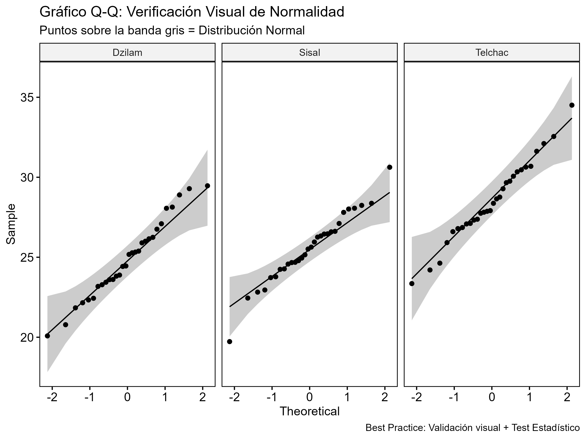

# 📊 BioStats Review: ANOVA y Verificación de Supuestos

### Descripción
Este proyecto es una implementación computacional en **R** de los métodos estadísticos descritos en el libro clásico **"Biometry" (Sokal & Rohlf, 4th Ed)**.

El objetivo es demostrar un flujo de trabajo riguroso para la comparación de medias, yendo más allá de la ejecución del modelo y enfocándose en la **validación de supuestos estadísticos** (Normalidad y Homocedasticidad).

### 🛠️ Flujo de Trabajo (Pipeline)
1.  **Simulación de Datos:** Generación de poblaciones sintéticas con parámetros controlados (`set.seed`) para garantizar reproducibilidad.
2.  **EDA (Exploratory Data Analysis):** Inspección visual de la distribución.
3.  **Validación de Supuestos:**
    * **Visual:** Gráficos Q-Q (Quantile-Quantile) por grupo.
    * **Matemática:** Prueba de Shapiro-Wilk y Prueba de Levene.
4.  **Modelado:** Ejecución condicional de ANOVA de una vía (o Welch si fallan supuestos).
5.  **Post-Hoc:** Prueba de **Tukey HSD** para comparaciones múltiples.

### 📈 Resultados Visuales

#### 1. Exploración de Datos
Observamos la dispersión inicial de las tallas por sitio.

#### 2. Verificación de Normalidad (Best Practice)
Combinamos la prueba de Shapiro-Wilk con la inspección visual. Los puntos sobre la banda gris confirman la distribución normal.

#### 3. Resultados del Modelo (Medias + SD)
Se encontró una diferencia significativa en el sitio **Telchac** (p < 0.001) respecto a las otras zonas.

---
*Autor: M. en C. Dylan Díaz* | *Basado en Sokal & Rohlf (2012)*